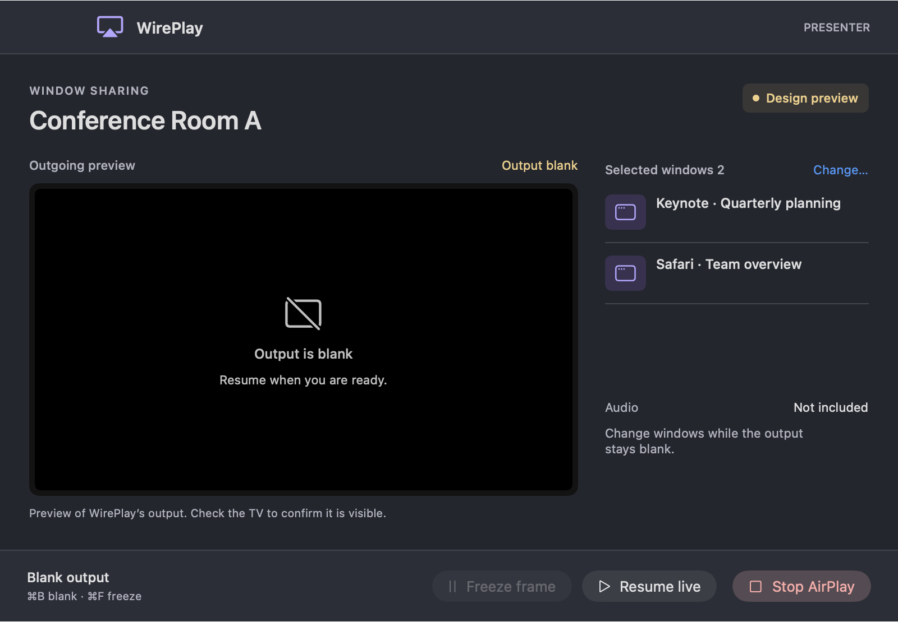

# Native implementation follow-up

October 8, 2026. Local build version: **1.1.0-beta.1-muha.1**, build **9**.

The original review and browser prototype are retained as history. This follow-up implements native changes in `Sources/`, `build.sh`, and `install.sh`. It is a local beta, not a hardware-certified release.

## Implemented

- Native SwiftUI presenter, receiver chooser, window chooser, and display-mode chooser preserve the approved violet skin, compact layout, and macOS light/dark appearance. The presenter shows real capture previews, selected window/app labels, audio status, and Change/Freeze/Blank/Stop controls. Command-B and Command-F work while the presenter has focus.
- Window search, refresh, explicit selection, keyboard controls, and completed-thumbnail fallback. The initial window selection remains empty; editing preserves the current blank/frozen output.
- Freeze retains the outgoing frame while capture continues; resuming uses current content. Blank removes the outgoing frame. Stopping is distinct from both. The preview is throttled to two updates per second and does not certify the physical TV image.
- Per-attempt, thread-safe cancellation identities prevent an old timeout from cancelling a new attempt. Pending cancellations retain ownership through their original deadline and a quiet interval. A short late-receiver watch uses separate black covers, so it cannot move another session's cover. Same-receiver reconnect and Quit are gated while cleanup remains incomplete.
- Receiver matching requires the exact AirPlay suffix/name; arbitrary Sidecar displays are rejected and existing matching receivers can be adopted. Extended Display confirmation requires a matching receiver and a positive mode button; unknown sheets fail closed.
- Stop, setup failure, target replacement, capture stop/failure, and Quit retain the output cover until driver confirmation and display disappearance. Failed disconnect keeps the cover and offers retry. A newly materialized cancelled receiver triggers another bounded disconnect attempt.
- Capture selection uses a fresh stream identity; stale starts, errors, and frames are ignored. Selection revisions reject old asynchronous multi-window work. System-picker callbacks are scoped to a presentation. Content changes go through WirePlay's Change action; the unguarded macOS sharing-menu change action is disabled.
- Active AirPlay receives presentation controls regardless of wired-monitor discovery. Discovery errors and empty results have visible recovery states. Capture retry preserves the requested destination.
- Both local and downloaded installation use one replacement function. It stages a clean copy, checks bundle identity and signature, asks a running app to quit normally, preserves the old app, verifies the replacement, and restores on failure. Failed rollback retains its backup. Downloads require the matching checksum asset.



This image renders the actual native view with example content; it is not a physical AirPlay session.

## Verification

```sh
./tests/check-session-state.sh
python3 tests/installer-safety.py
./build.sh
codesign --verify --deep --strict --all-architectures build/WirePlay.app
```

The production request-state checks exercise attempt identity, cancellation ownership, exact receiver matching, concurrent cancellation, and pending-disconnect deadlines. Ten installer cases cover normal replacement and failure paths using temporary dummy directories. Neither test connects an AirPlay receiver.

The ARM64 app and Control Center extension build. Independent review covered native lifecycle/ownership, the installer, and the Python test; follow-up findings were corrected. Gitleaks found no secrets in the changed source. The browser prototype's 16 checks remain separate from native verification.

The native build from commit `dc1ef27` was installed locally on October 8, 2026. The installed executable matches the built executable's SHA-256 and passes strict signature verification. The previous app was backed up before replacement. Launch and the receiver chooser's empty and refreshing states were checked through the installed app. No receiver was connected during this check.

Live chooser controls were verified through accessibility state. The automation tool returned an all-white window capture, so that capture is inconclusive for live visual appearance; the native render above is the visual evidence available. A direct on-screen appearance check remains open.

The old `state-checks.swift` and `installer-check.py` in this folder are historical reproductions at `0b45184`; the installer extraction expects that old checkout. Use the new `tests/` commands for current code.

## Limits still requiring physical testing

macOS may show a saved mirrored desktop before an identifiable AirPlay display exists. The app removes the former rescan delay and covers identified receivers promptly, but this does not establish zero initial exposure. The receiver UI advises closing private windows during connection. Late-arrival protection is bounded and cannot survive a forced process exit or crash.

Use an available TV and harmless windows for the first connection, PIN/mode sheet, saved Mirror default, cancel/retry, existing receiver, simultaneous Sidecar, blank/freeze/edit, target replacement, macOS stop, disconnect failure, Quit, network loss, sleep/lid changes, and audio-routing tests. Native VoiceOver and Intel execution remain unverified. No claim of a successful physical-TV test is made.
