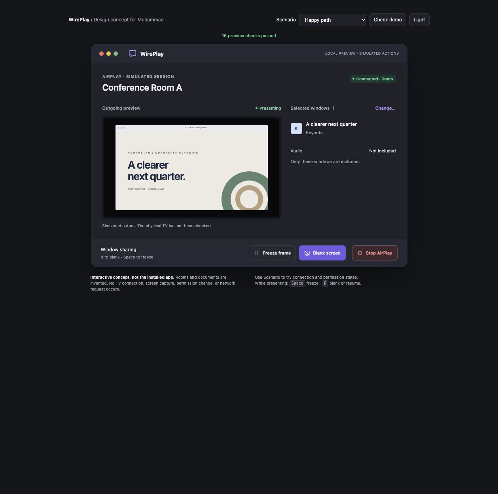

# Beta testers notes

**Update: the native implementation is now included. Start with [NATIVE_IMPLEMENTATION.md](NATIVE_IMPLEMENTATION.md) for the changes, current tests, and remaining hardware limitations.** The rest of this page records the original prototype handoff.

Review and design handoff for Ben, October 7, 2026. Based on the `airplay` branch at `0b45184dfe0cead28c211bb425effdd162a61a95` ([PR #2](https://github.com/ben-medpro/WirePlay/pull/2)).

**Original handoff scope (superseded by the native follow-up above):** This was an audit and working design prototype, not a patched native app. The branch contains the complete original app source plus this folder. `Sources/`, `Controls/`, installers, project files, and main README are unchanged. No native bug fix, installation, or physical AirPlay test is claimed.

## Start here

- [Developer notes](DEVELOPER_NOTES.md): prioritized problems and suggested fixes.
- [Full audit](REVIEW.md): evidence, source line references, build and security scope, and unfinished acceptance tests.
- [Interactive skin source](visual-preview.html): complete, self-contained HTML/CSS/JavaScript. Download or open the file in a browser; GitHub's source view does not execute it. There are no dependencies or external requests.
- [Screenshot](presenter-concept-v2.jpg): refined presenter panel.



## What was added and fixed in the prototype

These are implemented in `visual-preview.html` only:

1. Compact presenter panel: clearer room name, separate connection and output states, outgoing preview, exact selected-window titles, and an explicit audio label.
2. Searchable window grid with app/title labels, selection count, and explicit selection before presenting. New sessions start with nothing selected.
3. Separate **Freeze frame**, **Blank screen**, and **Stop AirPlay** controls. Freeze holds the prior composition; Blank hides it; Stop ends the simulated session. The Blank action has the strongest visual emphasis.
4. Selection changes preserve blank output. Changes while frozen preserve the previous frozen composition until resuming. The earlier prototype incorrectly showed the updated selection while frozen; that is fixed.
5. Resume clears both blank and frozen state. Stop and initial Disconnect clear the room and selections so stale choices cannot carry into a new session.
6. Present availability updates immediately after selecting or deselecting a card; the earlier prototype's step navigation could remain stale.
7. Simulated interrupted connections show an error state, and reconnect returns to blank output.
8. Light/dark appearance, keyboard-operable selection, focus styles, status announcements, and in-page shortcuts: **B** to blank/resume and **Space** to freeze/resume. These are not global macOS shortcuts.
9. Separate simulated no-TV, permission, and no-window states, plus a built-in **Check demo** button with 16 interaction assertions.

The room names, window titles, and screen contents are invented. The prototype performs no screen capture, actual AirPlay connection, permission change, or network request. Its preview does not establish what a physical TV displays. Some controls intentionally simulate recovery and refresh rather than invoking macOS APIs.

## Verification and how to run it

On macOS, from the repository root:

```sh
open beta-testers-notes/visual-preview.html
swift beta-testers-notes/state-checks.swift
python3 beta-testers-notes/installer-check.py
```

Click **Check demo** in the page: expected result is **16 preview checks passed**. Browser interaction, light/dark appearance, and JavaScript parsing were checked locally. This is not native VoiceOver certification.

`state-checks.swift` contains five historical characterizations of extracted logic from the reviewed commit. It asserts that the baseline bugs are present; it is not linked to `Sources/main.swift` and will not automatically test subsequent native fixes.

`installer-check.py` extracts narrow replacement blocks from the root installer scripts and runs them only against temporary dummy directories. It does not run the installers, install the app, or touch `/Applications`. Its three cases demonstrate copy failure, successful rollback, and failed rollback. The two loss cases are expected baseline findings, not passing safety tests. It expects the reviewed installer structure and may need updating after those scripts are fixed.

The ARM64 app and Control Center extension were built during the original audit. Strict code-signature verification passed on a clean staged copy outside Desktop after file-provider metadata caused the initial Desktop copy to fail. No distributable binary is included. Seven commits were scanned for secrets with no findings. See the full audit for limitations.

## What still needs native implementation

Priority order:

1. Own the whole AirPlay session lifecycle: keep black cover and receiver identity until confirmed disconnection; handle setup failure, cancellation, stale completion, target replacement, system stop, and Quit consistently.
2. Verify the selected receiver and Extended Display mode. Reject unrelated Sidecar displays and explicitly handle already-connected receivers.
3. Put Blank, window editing, and presentation status on the active AirPlay session; fix capture retry target selection and discovery error recovery.
4. Prevent stale selection/capture callbacks from replacing current output.
5. Make installer replacement and rollback preserve the existing app; require checksum verification.
6. Port the selected skin into the existing SwiftUI/AppKit app. Wire it to real states and native accessible controls. An optional floating mini-controller and a deliberate global Blank shortcut are subsequent improvements, not implemented features here.

Do not infer safe TV behavior from the browser demo or build success. Physical testing remains required for first connection, saved mirroring defaults, PIN prompts, cancel/retry, blank/stop/quit, reconnect, Sidecar, screen sleep, closed lid, and actual audio routing. Intel and native accessibility testing are also outstanding. Use harmless windows and an available TV.
